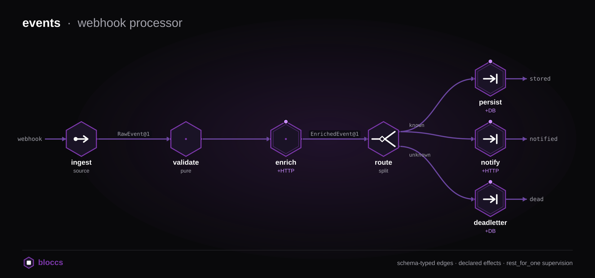
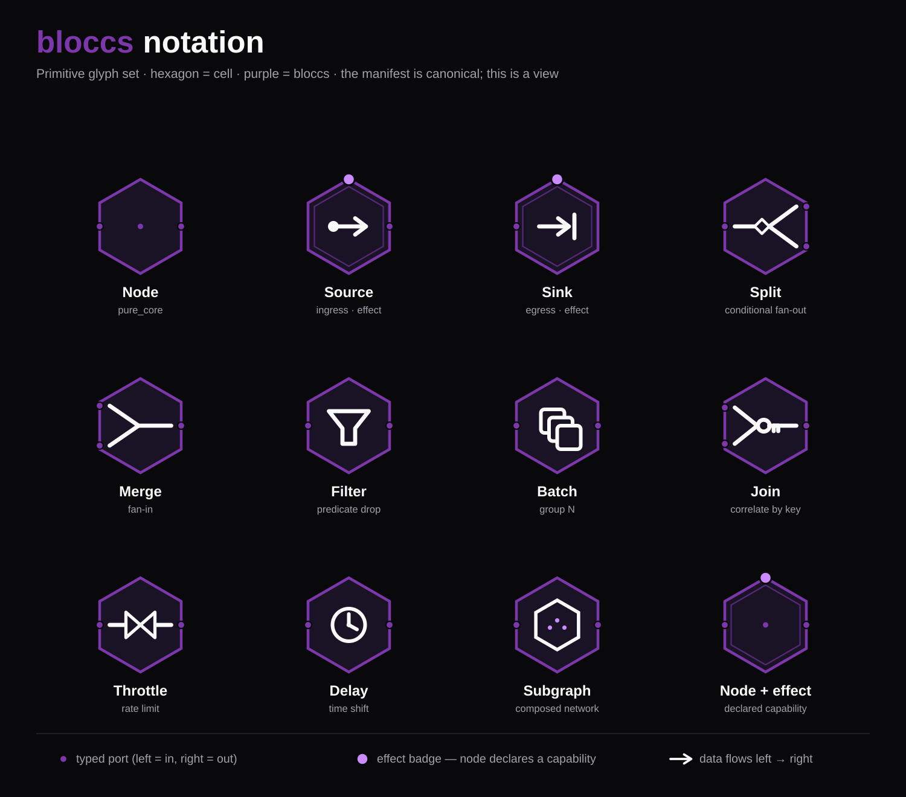
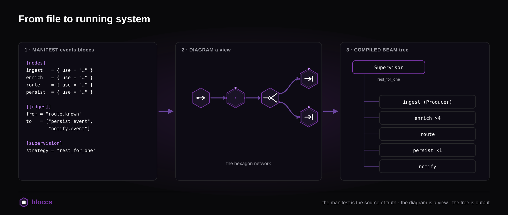

<p align="center">
  <a href="https://bloccs.io">
    <picture>
      <source media="(prefers-color-scheme: dark)" srcset="assets/bloccs-logo-dark.png">
      
    </picture>
  </a>
</p>

<p align="center"><strong>Typed, supervised dataflow on the BEAM.</strong></p>

You describe a graph of processing stages as TOML; bloccs type-checks the
wiring, enforces what each stage is allowed to do, and compiles it to a
Broadway/GenStage supervision tree.

<p align="center">
  
</p>

## Why bloccs?

Plenty of backend work is a *graph of stages*: ingest → validate → enrich →
branch → persist/notify. On the BEAM you'd build that today by hand-wiring a few
Broadway pipelines and a supervisor. That works, but nothing checks it:

- the **connections between stages are untyped** — stage A emits a map, stage B
  expects a different shape, and you find out in production;
- the **side effects are unconstrained** — any stage can call any host or table;
  nothing says `enrich` is only allowed to `GET` the enrichment service;
- **retry / timeout / idempotency / back-pressure** get re-implemented, slightly
  differently, in every pipeline;
- the **topology lives in your head** (and a supervisor module), not in a
  reviewable artifact;
- and once an **LLM is writing the pipelines**, you're auditing sprawling
  generated glue line by line — the shape of the system buried in code, with a
  wrong wiring or an unscoped side effect easy to miss in the diff.

bloccs makes the graph a declared, checked thing. You write the topology and the
per-stage contracts as TOML; bloccs rejects a graph whose edges don't type-match
*before it runs*, refuses an effect a node didn't declare, and generates the
Broadway supervision tree — as real, debuggable `.ex` source — with the retry /
timeout / idempotency / back-pressure already wired in. The artifact you review
is the manifest, not the generated glue — which is what keeps a human in control
when an LLM is doing the typing (see [Legible to humans and
LLMs](#legible-to-humans-and-llms)).

> **Why not just write Elixir, or use Broadway directly?** You can — and for a
> *single* pipeline you should (see [How it compares](#how-it-compares)). bloccs
> earns its keep once you have a *graph* and want the edges (schemas), the
> effects (capabilities), and the per-node policy declared and machine-checked
> rather than maintained by hand. The next section shows the two checks that
> aren't possible with plain Broadway.

## Install

```elixir
def deps do
  [{:bloccs, "~> 0.1"}]
end
```

bloccs is not on Hex yet (see [Status](#status)); until the first release, depend
on it from git: `{:bloccs, github: "Bloccs/bloccs"}`. The effect adapters are
bring-your-own and opt-in — add `{:req, "~> 0.5"}` for the real HTTP backend and
point the DB backend at your Ecto repo only if you use them (see
[`guides/effect-adapters.md`](guides/effect-adapters.md)).

## Quickstart

```bash
# scaffold a complete, runnable starter project (mix project + a sample node,
# its schemas, and a one-node network)
mix bloccs.new my_flow
cd my_flow
mix deps.get

# validate, compile to a Broadway supervision tree, then run a message through
mix bloccs.validate networks/hello.bloccs
mix bloccs.compile  networks/hello.bloccs
mix bloccs.run      networks/hello.bloccs --message '{"name": "ada"}'
```

`mix bloccs.compile` emits real, debuggable `.ex` source under
`_build/<env>/bloccs_generated/<network>/` — diff it in a PR. For a step-by-step
walkthrough that writes a node by hand, see
[`guides/getting-started.md`](guides/getting-started.md); for the vocabulary
(node, port, effect, schema, …) see [`guides/concepts.md`](guides/concepts.md).

## Typed edges and scoped effects

This is the part you can't get from hand-wired Elixir. Both examples below are
real output from the tour example (`examples/tour`).

**1. Mismatched edges are rejected at validation time.**
`examples/tour/networks/pipeline_mismatch.bloccs` wires an out-port carrying
`WordRequest@1` into an in-port that expects `Definition@1`. Validate it:

```bash
$ cd examples/tour
$ mix bloccs.validate networks/pipeline_mismatch.bloccs
✗ networks/pipeline_mismatch.bloccs
  - [[edges]] (networks/pipeline_mismatch.bloccs): edge accept.word → define.word
    schema mismatch: accept.word=WordRequest@1 but define.word=Definition@1
```

The network never starts. Plain Broadway has no contract between pipelines —
this mismatch would surface as a `FunctionClauseError` (or worse, silently wrong
data) at 3am.

**2. Undeclared side effects are refused.** A node may only touch the world
through effects it declared in `[effects]`. `define` declares HTTP to exactly
one host:

```toml
[effects]
http = { allow = ["dictionary.local"], methods = ["GET"] }
```

Call anything else and the capability struct refuses it at runtime:

```
# a host the node didn't allow:
bloccs effect denied: :http — host of http://evil.example/leak
                              not in declared allowlist ["dictionary.local"]

# an effect axis the node never declared at all:
bloccs effect denied: :http — axis not declared
```

And `use Bloccs.Node` warns you at *compile* time the moment the effect shell
reaches for an undeclared axis:

```
warning: bloccs: effect :http used in effect_shell but not declared in
         [effects]. Declared: [].
```

Typed edges and capability-scoped effects are the two guarantees that make a
bloccs graph safer than the same graph hand-wired.

## The manifests

Two kinds of TOML manifest:

- **Node manifests** (`.bloccs`, one node per file) — the node's input/output
  ports with versioned schemas, the effects it's allowed to perform (HTTP / DB /
  Time / Random), the pure-core and effect-shell function refs, and retry /
  timeout / idempotency / buffer policy.
- **Network manifests** — topology: which nodes wire to which, supervision
  structure, concurrency per node, and which ports are exposed.

```toml
# nodes/enrich.bloccs
[node]
id = "enrich"
version = "0.1.0"
kind = "transform"

[ports.in]
valid = { schema = "RawEvent@1" }

[ports.out]
enriched = { schema = "EnrichedEvent@1" }

[effects]
http = { allow = ["enrichment.local"], methods = ["GET"] }

[contract]
pure_core    = "MyApp.Nodes.Enrich.transform/2"
effect_shell = "MyApp.Nodes.Enrich.execute/2"
retry        = { strategy = "exponential", max = 2, on = ["timeout"], base_ms = 50 }
timeout_ms   = 3000
idempotency  = { key = "id" }
```

Each node's implementation is split in two: a **pure core** (no IO, no clock, no
randomness — easy to test, deterministic) and an **effect shell** that touches
the world, and only through declared effects.

## How it works

What the compiler emits from those manifests, and how each node behaves
once it's running.

### Flow primitives

A node's behavior is its ports + contract, not a fixed "type". From those, the
common dataflow shapes fall out — most are just what the effect shell returns,
the rest a small manifest block:

| primitive | how |
|---|---|
| **transform** | `pure_core` computes; shell emits one message |
| **filter** | shell returns `:drop` — consume, emit nothing |
| **split / fan-out** | shell returns `{:emit, [{port, payload}, …]}`, or one out-port wired to many in-ports |
| **route / branch** | a `router` shell picks which out-port to emit on |
| **merge (fan-in)** | several edges into one in-port |
| **aggregate / window** | `[batch]` — `pure_core` reduces the batch (count or time window) |
| **join** | `[join]` — correlate two+ typed in-ports by a key |
| **throttle / delay** | `[rate]` / `[delay]` |

<p align="center">
  
</p>

Conditional logic lives in node code (a returned port, a `:drop`), never in edge
predicates — which keeps the topology declarative and machine-checkable. See
[`guides/concepts.md`](guides/concepts.md) and the
[manifest reference](guides/manifest-reference.md).

### The generated runtime

<p align="center">
  
</p>

`mix bloccs.compile` reads the manifests and emits a Broadway-based supervision
tree — one stage per node, a router for edges, a producer for each inbound port.
Every declared contract is wired into that runtime, not just parsed:

- **Retry** — backed-off re-enqueue (constant / linear / exponential), matched
  against the failure reason; permanent failures (schema mismatch, capability
  denial) are never retried.
- **Timeout** — `timeout_ms` runs the node in a bounded task; overrun fails the
  message with `:timeout` (retriable).
- **Idempotency** — reserves the key in-flight (atomic), so concurrent
  first-deliveries can't both run; released on terminal failure.
- **Back-pressure** — a bounded `buffer` parks the producer's caller until a
  consumer drains, instead of dropping.
- **Observability** — `:telemetry.span([:bloccs, :node], …)` plus `:emit`,
  `:retry`, `:skipped`, and `:dispatch_error` events (see `Bloccs.Telemetry`).
  A failed downstream delivery is surfaced (telemetry + a failed message), never
  silently dropped.
- **Subgraph composition** — a `[nodes]` entry may `use` a *network* manifest;
  the parser flattens it into namespaced leaf nodes at parse time.

### Effects: mock by default, real adapters opt-in

Nodes call a backend-agnostic facade (`Bloccs.Effects.HTTP.post/3`,
`DB.insert/3`, …). The mock backends are the default (tests stay hermetic); the
real ones are selected purely in config, with no node changes:

```elixir
config :bloccs, :effect_backends,
  http: Bloccs.Effects.HTTP.Req,    # real HTTP via Req (add :req to your deps)
  db:   Bloccs.Effects.DB.Ecto      # real SQL via your Ecto repo

config :bloccs, Bloccs.Effects.DB.Ecto, repo: MyApp.Repo, returning: [:id]
```

`bloccs` forces neither `req` nor Ecto on you — both are bring-your-own. Write
your own backend by implementing the `Bloccs.Effects.HTTP` / `DB` behaviour. See
[`guides/effect-adapters.md`](guides/effect-adapters.md). A runnable example
hitting real HTTP + SQLite (zero external services) lives in
[`examples/real_backend`](https://github.com/Bloccs/bloccs/tree/main/examples/real_backend).

### CLI (Mix tasks)

- `mix bloccs.new <name>` — scaffold a new project
- `mix bloccs.validate <file>` — schema / contract / DAG checks on a node or network
- `mix bloccs.compile <network>` — emit the Broadway supervision tree
- `mix bloccs.run <network> --message <json> [--trace <out>]` — start the tree,
  feed a message, optionally record a `.bloccs-trace`
- `mix bloccs.coverage <network> [--message <json> | --trace <file>]` — real
  structural coverage (every in-port, out-port, and edge) from a recorded run

### Legible to humans and LLMs

A bloccs network is a small declarative artifact: the topology is a TOML file,
and each node is a manifest plus two functions (a pure core and an effect
shell). The thing you *review* stays small even when an assistant writes most of
the implementation.

- **You review the graph, not the glue.** A change to the flow is a diff to a
  `.bloccs` file — which ports moved, which edge appeared — not a re-read of
  regenerated supervisor and pipeline code. The generated `.ex` is there to
  inspect when you want it, but the manifest is what you read.
- **A change's blast radius is one node.** Each node is a bounded unit: a
  manifest, a `pure_core`, an effect shell. An assistant can add or alter a node
  without reaching into the rest of the tree.
- **The boundaries are machine-checked, so you don't have to take the code's
  word for it.** A mis-wired edge is rejected at validation time; an undeclared
  host or table is refused. An LLM can move fast and still cannot connect
  mismatched stages or smuggle in an unscoped side effect — the compiler stops
  it before it runs.

So you can hand the repetitive parts to an assistant and stay in control of the
*shape* of the system, instead of drowning in generated code you have to audit
line by line.

## Examples

A graded ladder under [`examples/`](https://github.com/Bloccs/bloccs/tree/main/examples) — see [`examples/README.md`](https://github.com/Bloccs/bloccs/blob/main/examples/README.md):

- [`examples/tour`](https://github.com/Bloccs/bloccs/tree/main/examples/tour) — core concepts one rung at a time
  (`mix tour.hello` · `mix tour.pipeline` · `mix tour.branching`), mock effects,
  zero setup.
- [`examples/events`](https://github.com/Bloccs/bloccs/tree/main/examples/events) — the flagship: a webhook/event processor
  showing typed edges, HTTP + DB effects, retry, timeout, idempotency, branching,
  fan-out, and coverage (the `events.demo` task).
- [`examples/real_backend`](https://github.com/Bloccs/bloccs/tree/main/examples/real_backend) — the same shape against real
  HTTP (Req) + SQLite (Ecto) (`mix price_watch.demo`).

## How it compares

bloccs **generates** Broadway — it isn't a competitor to it. Reach for Broadway
directly when you have a single pipeline; reach for bloccs when you have a *graph*
of typed stages and want the edges (schemas), effects (capabilities), and
per-node policy (retry / timeout / idempotency / back-pressure) declared and
checked, with the topology as a reviewable artifact. It is **not** durable — for
work that must survive restarts, put Oban or a broker at the edges. Full
comparison against Broadway, Oban, Reactor, Temporal, LangGraph, and plain
GenServers: [`guides/comparison.md`](guides/comparison.md).

### Prior art

Flow-based programming on the BEAM isn't new. Anton Mishchuk's lineage —
[Flowex](https://github.com/antonmi/flowex) → [ALF](https://github.com/antonmi/ALF)
→ [Strom](https://github.com/antonmi/strom) / [Kraken](https://github.com/antonmi/kraken)
— spent years establishing that the actor model and GenStage make the BEAM a natural
home for FBP, and Kraken reached the same "graph-as-data + declarative adapters" idea
bloccs builds on. bloccs owes that groundwork.

The difference is the guarantees, not the shape:

- **Compile-time contracts.** Edges are schema-checked and effects are
  capability-checked *before* the network runs; that lineage validates (or trusts) at
  runtime.
- **Reviewable output.** bloccs emits the Broadway supervision tree as real `.ex`
  source you can read and diff. ALF interprets a runtime DSL; Kraken compiles JSON to
  modules at runtime. A bloccs network is something you can `git diff`.
- **A settled substrate.** bloccs commits to Broadway; the lineage moved between
  GenStage and plain streams.

**What bloccs is _not_:** a runtime DSL (the manifest is compiled ahead of time, not
interpreted), a data-ingestion pipeline (that's Broadway — which bloccs generates), a
visual builder (the file is canonical; a canvas is a view), or durable (put Oban or a
broker at the edges for work that must survive restarts).

## Status

**v0.1 — pre-release.** Not yet on Hex; APIs may change before the first
release. The full **parse → validate → compile → run** loop works end to end, and
everything the manifests can declare is honored at runtime:

- the **flow primitives** — transform, filter, split / fan-out, route, merge,
  batch / window, join, throttle, delay (see [Flow primitives](#flow-primitives));
- **per-node contracts** — retry, timeout, idempotency, bounded-buffer
  back-pressure, and `:telemetry` spans, wired into the generated tree;
- **scoped effects** with real HTTP / DB adapters behind a config switch;
- **subgraph composition** (`use` a network as a node);
- **trace + real structural coverage** (`mix bloccs.coverage`).

See [`guides/ARCHITECTURE.md`](guides/ARCHITECTURE.md) for the compile pipeline.
The deferred items are listed under [Out of scope](#out-of-scope-for-v01).

> **A note on the name.** In the design docs you'll see bloccs called an *IR for
> Agentic Computation Graphs (ACGs)* — the north star is typed, supervised graphs
> with LLM/tool nodes as first-class stages. Today the engine is the
> general-purpose, agent-agnostic core: typed dataflow on the BEAM. The "agentic"
> layer is a roadmap direction, not a v0.1 claim — every example here is ordinary
> backend dataflow.

### Out of scope for v0.1

Phoenix LiveView canvas (v0.3+) · MCP server (v0.2) · Pro / encrypted packages
(private repo, post-v0.1) · polyglot `pure_core` · cyclic networks (DAG-only;
feedback loops are a deadlock-safety design still on the roadmap) · escript-packaged
binary · full Dialyzer-level static effect proof · durable persistence.

## License

MIT. Pro extensions ship later in a separate private repo (modeled on Oban Pro).
