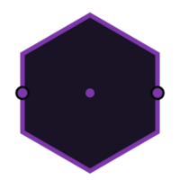
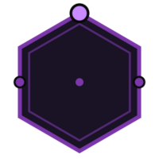

# Primitives

bloccs has no fixed node *types* — a node's behaviour is its **ports + contract**.
From those, a small set of dataflow **primitives** fall out: most are just what
the effect shell returns, the rest a one-line manifest block. Each has a glyph in
the bloccs notation, and a node that declares an effect carries a badge.

This page is the catalogue — what each primitive does and how to declare it. For
the field-by-field manifest spec see the [manifest reference](manifest-reference.md);
for the ideas behind them, [Core concepts](concepts.md).


| primitive | what it does | declared via |
|---|---|---|
| **Transform** | compute a result, emit one message | `kind = "transform"` |
| **Source** | the network's entry — a node on an exposed in-port | `[expose].in` |
| **Sink** | the network's exit — usually an egress effect | `[expose].out` |
| **Effectful node** | may touch the world, only through what it declares | `[effects]` |
| **Filter** | drop a message, emit nothing | shell returns `:drop` |
| **Split / fan-out / route** | many outputs from one node | shell returns `{:emit, […]}` |
| **Merge** | several edges into one in-port (fan-in) | wiring |
| **Batch** | reduce a count/time window of messages | `[batch]` |
| **Join** | correlate distinct typed inputs by a key | `[join]` |
| **Throttle** | cap delivery rate | `[rate]` |
| **Delay** | time-shift each message | `[delay]` |
| **Subgraph** | reuse a whole network as a node | `[nodes]` `use` |

Each primitive's glyph appears with its section below.

## The node and its boundaries

### Transform



The default node. `pure_core` computes a result from the inbound message; the
effect shell emits one message on an out-port.

```toml
[node]
kind = "transform"

[contract]
pure_core    = "MyApp.Nodes.Greet.transform/2"
effect_shell = "MyApp.Nodes.Greet.execute/2"
```

```elixir
def execute(result, _ctx), do: {:emit, :out, result}
```

### Source


A node wired to an exposed input port — where messages enter the network. It's an
ordinary node; the *role* is being the entry. Often an ingress effect (normalize
a webhook, read a queue).

```toml
[expose]
in = { webhook = "ingest.received" }
```

### Sink


A node whose output is an exposed port — a terminal of the network. Usually an
egress effect (DB insert, HTTP POST).

```toml
[expose]
out = { stored = "persist.stored" }
```

### Effectful node



Any node that declares `[effects]` may touch the world — and **only** through what
it declares. Undeclared use is refused at runtime and warned at compile time. In
the notation it carries the badge.

```toml
[effects]
http = { allow = ["enrichment.local"], methods = ["GET"] }
```

## Routing and shape

### Filter


Drop a message: the effect shell returns `:drop`. The message is consumed,
nothing is emitted, and a `[:bloccs, :node, :dropped]` event fires.

```elixir
def execute(%{"spam" => true}, _ctx), do: :drop
def execute(data, _ctx),          do: {:emit, :out, data}
```

### Split, fan-out, and route


One node, many outputs. Emit several messages in one call, *route* by picking an
out-port, or fan one out-port to many in-ports in the network.

```elixir
# multi-emit: several ports / payloads at once
def execute(order, _ctx), do: {:emit, [{:ledger, order}, {:receipt, order}]}

# route: pick the out-port
def execute(evt, _ctx), do: {:emit, (if known?(evt), do: :known, else: :unknown), evt}
```

```toml
# or fan one out-port to many in-ports, in the network
[[edges]]
from = "route.known"
to   = ["persist.event", "notify.event"]
```

### Merge


Several edges into one in-port — an undifferentiated fan-in (one stream). No
construct; just wire them. To correlate *distinct typed* inputs by a key instead,
use a [join](#join).

```toml
[[edges]]
from = "a.out"
to   = "collect.inbound"

[[edges]]
from = "b.out"
to   = "collect.inbound"
```

## Windows, timing, and correlation

### Batch


Process messages in count- or time-windows. `pure_core` receives the **list** of
payloads (not one) and reduces them; the window flushes at `size` messages or
after `timeout_ms` idle, whichever is first.

```toml
[batch]
size       = 100
timeout_ms = 5000
```

### Join


Correlate two or more distinct typed in-ports by a key field (`on`). When every
in-port has produced a payload for the same key, `pure_core` receives
`%{port => payload}`. (The one case where a node has more than one in-port — each
compiles to its own pipeline.)

```toml
[ports.in]
left  = { schema = "Order@1" }
right = { schema = "Payment@1" }

[join]
on         = "order_id"
timeout_ms = 30000
deadletter = "unmatched"
```

### Throttle


Cap how fast the node's producer delivers downstream, using Broadway's producer
rate limiter.

```toml
[rate]
allowed     = 100
interval_ms = 1000
```

### Delay


Hold every message `ms` before it enters the node — the producer time-shifts
delivery. The push is acked immediately, so it does *not* back-pressure.

```toml
[delay]
ms = 5000
```

## Composition

### Subgraph


Reuse a whole network as a node: a `[nodes]` entry `use`s a *network* manifest
instead of a node manifest. The parser flattens it into namespaced leaf nodes
(`enrich.up`, …) at parse time, so the rest of the graph only sees a flat DAG.

```toml
[nodes]
enrich = { use = "../networks/enrichment.bloccs" }
```

---

Conditional logic lives in node code (a returned port, a `:drop`), never in edge
predicates — which is what keeps the topology declarative and machine-checkable.
